<html>
  <body>
    
The goal of this project was to prepare a game report for a pitching coach, and then provide an evaluation of the pitcher's performance. Performance was limited to release speed. 

    <h1>Biomechanics Game Report: 2022-10-28</h1>
    <h3>Justin Verlander</h3>
      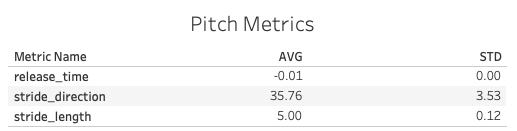
      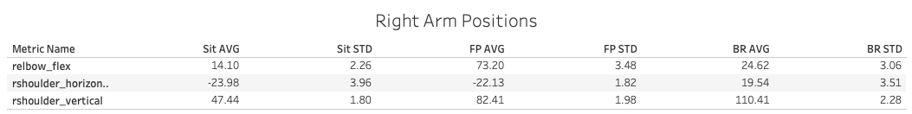
      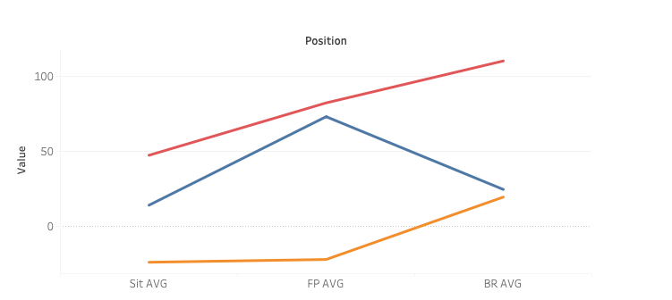
      
      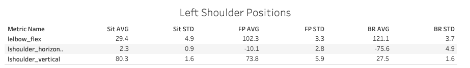
      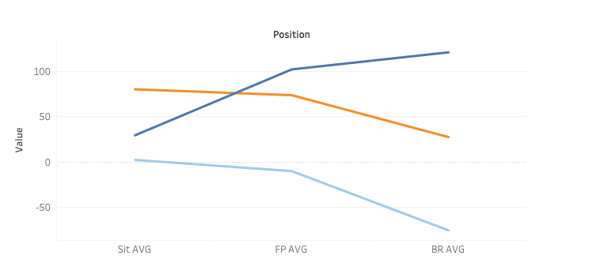
      
      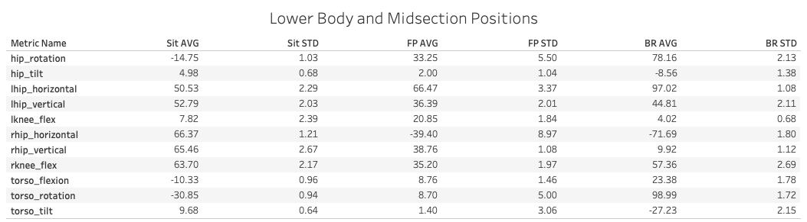
      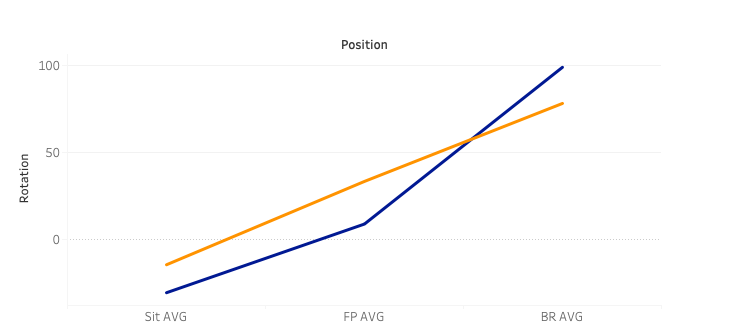
      
      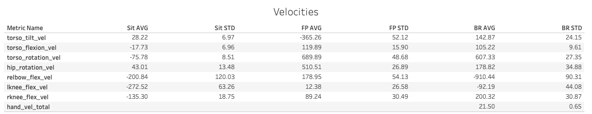
      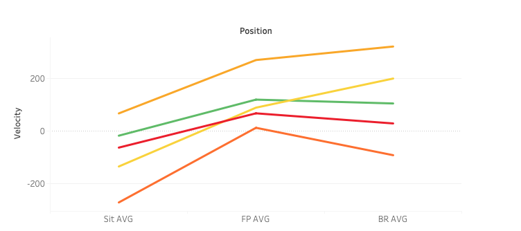
      
    <h1>Game Analysis</h1>
    
The pitching motion is a very complex movement, and for it to be done at 
      the highest levels everything must be working together. To get a better understanding
       of Verlander's pitching velocity let's start with looking at the correlations with 
       the biomechanic metrics. The left chart shows the 4 highest positive correlations 
       to release speed, while the one the right shows the 4 highest negative. 

       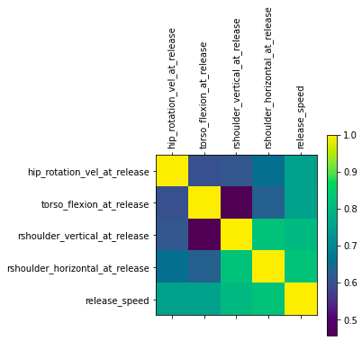
       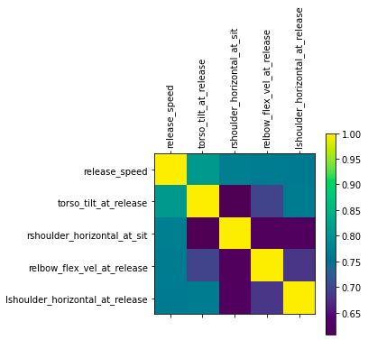
    
Here you can see the metrics with the highest correlations are all metrics involving the release,
       and this makes sense. When the ball is being released that is when you want to be at
        your fastest, but it doesn't necessarily tell us how Verlander got there. 

    
Using a Random Forest Regression we can get a better understanding of where Verlander's speed
      is coming from. After trying multiple forms of regression it seemed random forest was the best fit for the data.
      I created two models, one for fastballs and one for all pitches. After performing this analysis, the model 
      identified the 3 most important metrics for fastballs were: lead wrist rotation at release, stride length, and left hip 
      vertical at footplant. The model used for all pitches identified right shoulder vertical and horizontal position at release to 
      be the most important features. 
    

    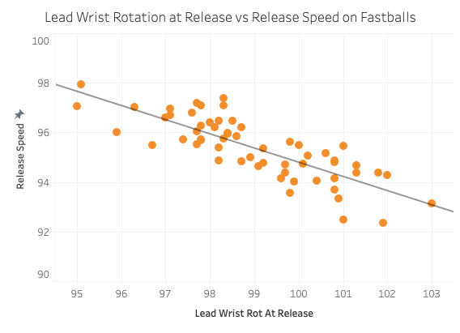
    
Here you can see the effect lead wrist rotation has on release speed. 
      The earlier Verlander is rotating his lead wrist, the slower his fastball is going. A possible reason for this outcome could be that
    Verlander is becoming overly seperated during his motion, and is unable to rotate properly. This could also be referred to as "poor timing." 

      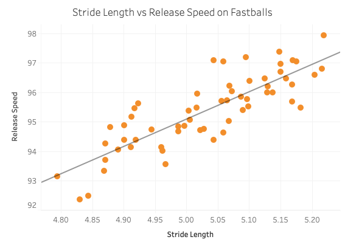
      
Here you can see the effect stride length has on release speed. When Verlander is 
        making a longer stride during his motion his fastballs are going faster. This suggests
        that his lower body is moving with better mechanics and the result is a longer stride length, as well 
      as a faster pitch. A shorter stride length could also be a protection against a fast base runner and have nothing to do with Verlander's mechanics.  

      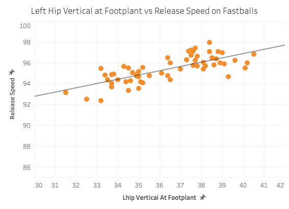
    
Here you can see the effect that the left hip position at footplant has on release speed. This could suggest that
      when Verlander is throwing faster, his left knee is less flexed and thus it is easier for him to apply force into the ground. 
    For example when you are doing a squat, the lower you go the harder it is to redirect the wieght. 

      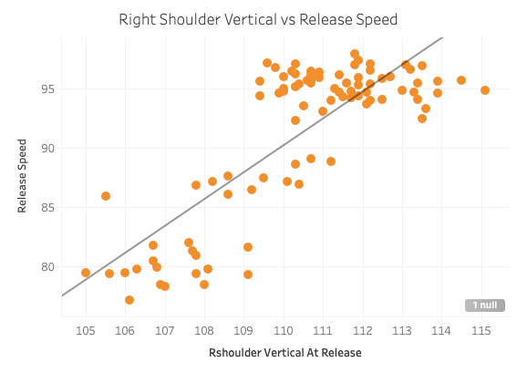
    
Here you can see the impact the right shoulder position has on the release. This shows that when Verlander's shoulder 
      is higher at release he is throwing the ball faster. This is a good indicator that his mechanics are well timed up to the release. 

    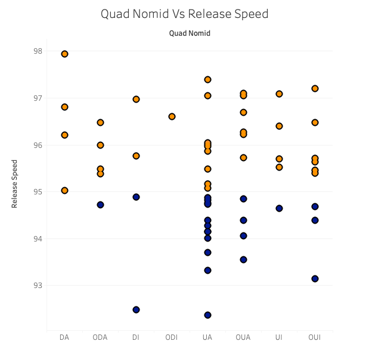
    
Pitcher's are usually judged by their worst pitches because those are the ones that get hit. From this graphic, you can 
      see that the majority of Verlander's slower fastballs were thrown up in the zone. This suggests a change in mechanics 
      when throwing high that is leading to less velocity. 

    
Baseball is a game of inches, and in this game Verlander's mechanics were off on some pitches, and great on others.
         It is hard to say whether he performed well based on velocity alone, because his slowest pitches weren't the ones that got hit.
        However, if we are judging performance solely based on release speed, the metrics I highlighted in my analysis are what I believe to be
        what had the biggest effect on performance.

  </body>
</html>

